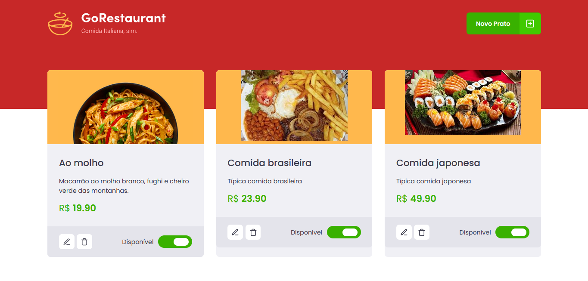

# GoRestaurant Web

**GoRestaurant Web** is a web application developed during the GoStack bootcamp by @rocketseat. It allows users to manage the restaurant's menu by adding and updating dishes.

<p align="center">
  
</p>

## Features

- **Dish Management:** Add and update dishes in the restaurant's menu.
- **User Interface:** Simple and intuitive UI for managing menu items.

## Getting Started

To get started with the project, clone the repository and install the dependencies:

```bash
git clone https://github.com/renatosilveira99/go-restaurant-web
cd go-restaurant-web
npm install
```

Then, start the development server:

```bash
npm start
```

## Technologies

- **React**: JavaScript library for building user interfaces.
- **TypeScript**: Typed superset of JavaScript for better development experience.
- **Styled-components**: Library for styling components using tagged template literals.
- **React Router DOM**: For handling routing in React applications.
- **Unform**: Library for managing forms in React.
- **Yup**: Schema validation library used with Unform.

## Scripts

- **`start`**: Runs the app in development mode.
- **`build`**: Builds the app for production.
- **`test`**: Runs the test suite.
